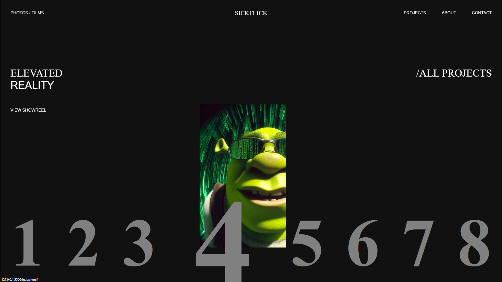

# 🚁 SickFlick - Hover Animation Website

A sleek and interactive website showcasing hover animations using **GSAP**. When you hover over the items, images smoothly pop up and follow your cursor for a dynamic and engaging experience. The animations are designed to bring creativity to the forefront, making it ideal for portfolios, galleries, and other visually driven websites.



## 🛠 Tech Stack

This project is built using:

- **HTML** 📝  
  The structure of the website, providing the content layout.
  
- **CSS** 🎨  
  Responsible for styling the site and ensuring it looks modern and responsive.
  
- **JavaScript** 💻  
  Powers the dynamic behavior of the site, handling interactivity and user engagement.
  
- **GSAP (GreenSock Animation Platform)** ✨  
  A powerful animation library that allows for high-performance animations. GSAP makes the hover effects and image pop-ups smooth and engaging.


## 🚀 Get Started

To run this project locally, follow these steps:

1. **Clone the repository:**
   ```bash
   git clone https://github.com/your-username/SickFlick.git
